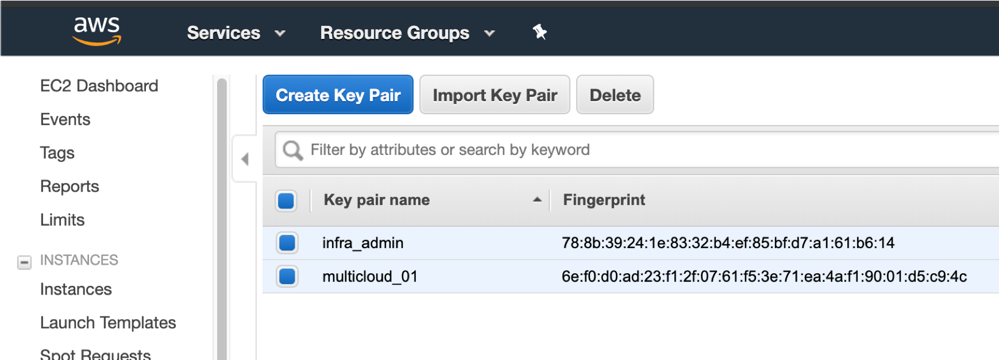
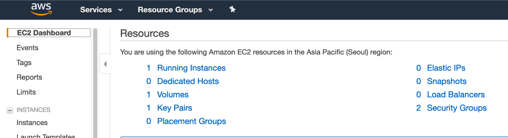
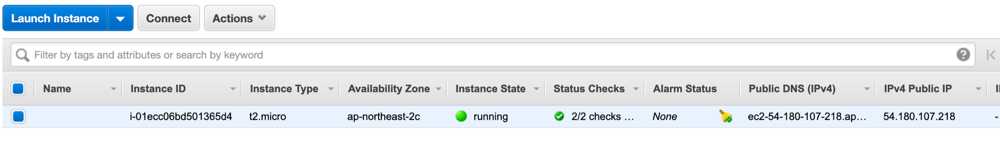

# AWS에 EC2 배포하기

> AWS에 사용자 계정 생성과 관련된 ACCESS KEY, SECRET 정보는 사전에 확인 되었음을 가정하고 설명합니다.
> 또한, 개발/테스트 환경은 Terraform, Ansible이 되어있다고 가정합니다.


## Provider 정의

Provider로 자원을 생성할 목표 환경의 정보를 입력합니다. 
현재 VM을 생성할 환경은 AWS이므로 관련된 정보를 다음과 같이 ```provider.tf``` 파일에 입력합니다.

AWS 접속 중인 계정에서 확인 한 ```ACCESS KEY```, ```SECRET KEY``` 를 함께 입력합니다.

~~~shell
provider "aws" {
  access_key = "<AWS_ACCESS_KEY>"
  secret_key = ""<AWS_SECRET_KEY>"
  region = "ap-northeast-2"
}
~~~

파일을 생성하였으면 다음의 명령을 통해서 정상 동작 확인 합니다.

```shell
$ terraform init
```

아래와 같은 메시지를 확인하였으면 정상 동작입니다.

```shell
Initializing the backend...

Initializing provider plugins...
- Checking for available provider plugins...
- Downloading plugin for provider "aws" (terraform-providers/aws) 2.12.0...

The following providers do not have any version constraints in configuration,
so the latest version was installed.

To prevent automatic upgrades to new major versions that may contain breaking
changes, it is recommended to add version = "..." constraints to the
corresponding provider blocks in configuration, with the constraint strings
suggested below.

* provider.aws: version = "~> 2.12"

Terraform has been successfully initialized!

You may now begin working with Terraform. Try running "terraform plan" to see
any changes that are required for your infrastructure. All Terraform commands
should now work.

If you ever set or change modules or backend configuration for Terraform,
rerun this command to reinitialize your working directory. If you forget, other
commands will detect it and remind you to do so if necessary.
```

## EC2 접속을 위한 Key-pair 생성

EC2 인스턴스 생성 후 ssh 접속을 위한 key-pair를 생성하고 AWS 환경에 등록합니다.

우선 다음의 명령을 통해서 key 를 생성합니다.

~~~shell
$ ssh-keygen -t rsa -b 4096 -C "<EMAIL_ADDRESS>" -f "$HOME/.ssh/infra_admin" -N ""
~~~

key 파일 생성 후 ```infra.tf``` 파일을 생성하여 key-pair 등록을 위한 HCL을 작성합니다.

~~~shell
esource "aws_key_pair" "infra_admin" {
  key_name = "infra_admin"
  public_key = "${file("~/.ssh/infra_admin.pub")}"
}
~~~

퍄일 생성 완료를 하였으면 다음 명령을 통해서 key-pair를 등록합니다.

~~~shell
$ terraform plan
$ terraform apply
~~~

명령 실행 결과 다음과 같은 메시지를 확인하면 정상 동작한 것입니다.

~~~
aws_key_pair.infra_admin: Creation complete after 0s (ID: infra_admin)

Apply complete! Resources: 1 added, 0 changed, 0 destroyed.
~~~

또한 다음과 같이 AWS Console에서 생셩된 Key pair를 확인 할 수 있습니다.



## 리소스 정의하고 생성하기

이제부터는 EC2 인스턴스 생성을 위해 필요한 리소스를 추가하고 최종적으로 VM 인스턴스가 생성되도록 정의합니다.

앞서 작성했던 ```infra.tf``` 파일에 다음의 내용을 추가합니다.

~~~shell
resource "aws_security_group" "infra_ssh" {
  name = "allow_ssh_from_all"
  description = "Allow SSH port from all"
  ingress {
    from_port = 22
    to_port = 22
    protocol = "tcp"
    cidr_blocks = ["0.0.0.0/0"]
  }
}

data "aws_security_group" "default" {
  name = "default"
}

data "aws_ami" "ubuntu" {
  most_recent = true
  filter {
    name = "name"
    values = ["ubuntu/images/hvm-ssd/ubuntu-xenial-16.04-amd64-server-*"]
  }
  filter {
    name = "virtualization-type"
    values = ["hvm"]
  }
  owners = ["099720109477"] # Canonical
}

resource "aws_instance" "erver01" {
  ami = "${data.aws_ami.ubuntu.id}"
  instance_type = "t2.micro"
  key_name = "${aws_key_pair.infra_admin.key_name}"
  vpc_security_group_ids = [
    "${aws_security_group.infra_ssh.id}",
   "${data.aws_security_group.default.id}"
  ]

  connection {
    user = "ubuntu"
    type = "ssh"

    private_key = "${file("~/.ssh/infra_admin")}"
    timeout     = "2m"
  }

  provisioner "remote-exec" {
    inline = [
      "sudo apt-get update",
      "sudo apt-get install -y python",
    ]
  }
}
~~~


파일 수정 후 다음의 명령을 통해서 AWS 에 반영합니다.

~~~shell
$ terraform plan
$ terraform apply
~~~

정상적으로 생성이 되었으면 콘솔에서 다음 화면과 같이 ```Volume```, ```Security Groups```, ```Running instances``` 항목에 생성된 갯수를 확인 할 수 있습니다.



```Running instances``` 항목을 클릭하여 들어가면 terraform 에 의해 생성된 VM 인스턴스를 확인 할 수 있습니다. 




## 터미널 접속 해보기

EC2 instance가 생성되었으면 다음과 같이 터미널 접속을 해 봅니다.   
터미널 접속을 위해서는 앞서 생성했단 private key를 이용하여 접속합니다.

> VM의 PUBLIC IP는 위 콘솔 화면에서 확인 가능합니다.


~~~shell
$ ssh -i ~/.ssh/infra_admin ubuntu@<VM PUBLIC IP>
~~~

## 리소스 삭제하기
테스트 완료 후에 리소스를 삭제하기 위해서는 다음의 명령을 사용합니다.

~~~shell
$ terraform plan --destroy
$ terraform destroy
~~~